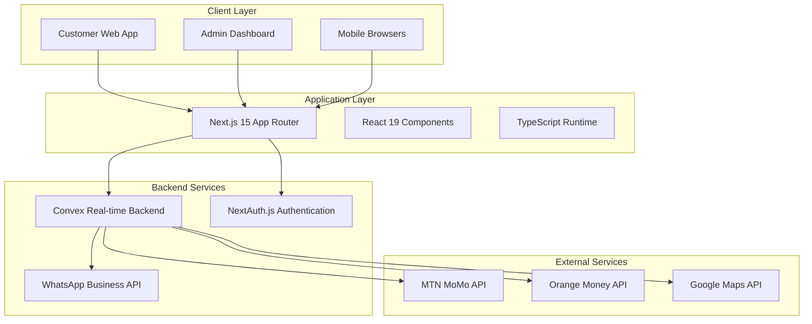
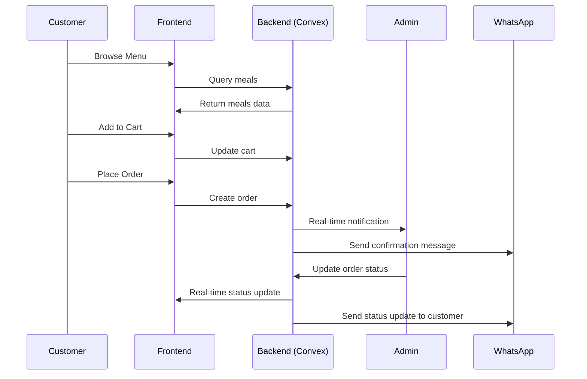
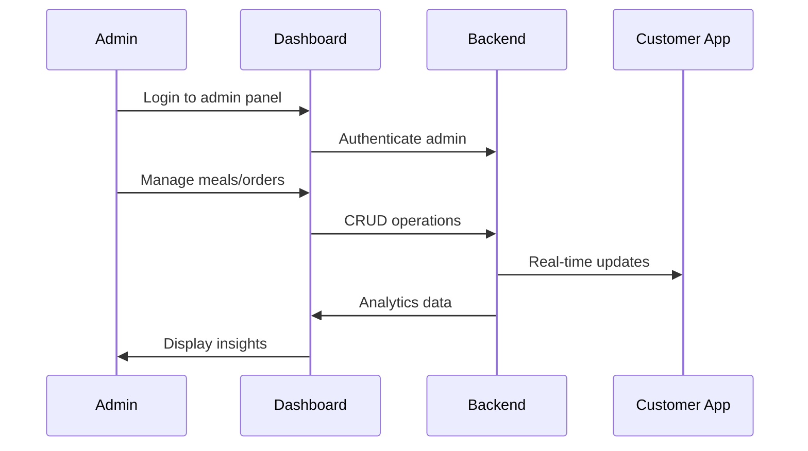
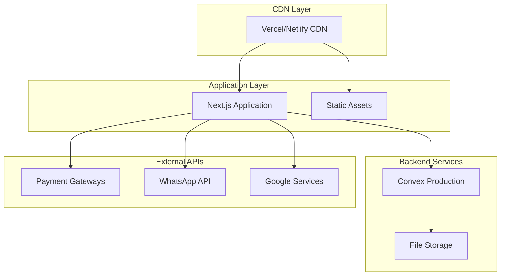

# 🏗️ System Architecture

Technical architecture and design overview of Sunshine Restaurant.

## 🎯 Architecture Overview

Sunshine Restaurant follows a modern, scalable architecture designed specifically for restaurant operations in the Cameroonian market.

### High-Level Architecture



---

## 🏭 Technical Stack

### Frontend Technologies

| Component | Technology | Version | Purpose |
|-----------|------------|---------|---------|
| **Framework** | Next.js | 15.x | React framework with App Router |
| **UI Library** | React | 19.x | Component-based UI |
| **Language** | TypeScript | 5.x | Type-safe development |
| **Styling** | Tailwind CSS | 3.4.x | Utility-first CSS |
| **UI Components** | shadcn/ui | Latest | Pre-built components |
| **Icons** | Lucide React | Latest | Consistent iconography |
| **Forms** | React Hook Form | Latest | Form management |
| **Validation** | Zod | Latest | Schema validation |

### Backend Technologies

| Component | Technology | Purpose |
|-----------|------------|---------|
| **Backend** | Convex | Real-time serverless backend |
| **Database** | Convex DB | Built-in real-time database |
| **Authentication** | NextAuth.js | User authentication system |
| **File Storage** | Convex File Storage | Image and document storage |
| **Real-time** | Convex Subscriptions | Live data updates |

### External Integrations

| Service | Purpose | Status |
|---------|---------|--------|
| **WhatsApp Business API** | Customer communication | Planned |
| **MTN MoMo API** | Mobile money payments | Planned |
| **Orange Money API** | Mobile money payments | Planned |
| **Google Maps API** | Location services | Planned |

---

## 🗄️ Database Design

### Convex Schema Architecture

The database follows a relational design optimized for restaurant operations:

#### Core Business Entities

```typescript
// User Management
users: {
  _id: Id<"users">,
  email: string,
  name: string,
  role: "USER" | "ADMIN",
  phone?: string,
  createdAt: number,
  emailVerified?: boolean
}

// Menu Management
meals: {
  _id: Id<"meals">,
  name: string,
  description: string,
  price: number,
  categoryId: Id<"categories">,
  images: string[],
  dietary: {
    vegetarian: boolean,
    vegan: boolean,
    halal: boolean,
    glutenFree: boolean,
    spicy: number
  },
  availability: "IN_STOCK" | "OUT_OF_STOCK" | "SEASONAL",
  featured: boolean,
  createdAt: number,
  updatedAt: number
}

categories: {
  _id: Id<"categories">,
  name: string,
  description: string,
  displayOrder: number,
  active: boolean,
  createdAt: number
}

// Order Management
orders: {
  _id: Id<"orders">,
  userId: Id<"users">,
  items: Array<{
    mealId: Id<"meals">,
    quantity: number,
    price: number,
    specialInstructions?: string
  }>,
  status: "PENDING" | "CONFIRMED" | "PREPARING" | "READY" | "OUT_FOR_DELIVERY" | "DELIVERED" | "CANCELLED",
  totalAmount: number,
  deliveryFee: number,
  deliveryAddress?: {
    street: string,
    neighborhood: string,
    landmark: string,
    phone: string
  },
  paymentMethod: "CASH" | "MTN_MOMO" | "ORANGE_MONEY",
  paymentStatus: "PENDING" | "PAID" | "FAILED",
  createdAt: number,
  updatedAt: number
}
```

#### Supporting Entities

```typescript
// Cart System
cart: {
  _id: Id<"cart">,
  userId: Id<"users">,
  items: Array<{
    mealId: Id<"meals">,
    quantity: number
  }>,
  updatedAt: number
}

// Restaurant Configuration
restaurantConfig: {
  _id: Id<"restaurantConfig">,
  name: string,
  description: string,
  address: string,
  phone: string,
  email: string,
  operatingHours: Record<string, { open: string, close: string, isOpen: boolean }>,
  deliveryFee: number,
  minimumOrder: number,
  acceptingOrders: boolean,
  whatsappNumber?: string
}

// Delivery Management
deliveryZones: {
  _id: Id<"deliveryZones">,
  name: string,
  deliveryFee: number,
  estimatedTime: number, // minutes
  active: boolean
}
```

### Database Relationships

- **One-to-Many**: Categories → Meals
- **One-to-Many**: Users → Orders  
- **One-to-Many**: Users → Cart
- **Many-to-Many**: Orders ↔ Meals (through order items)
- **One-to-One**: Restaurant Config (singleton)

---

## 🔐 Authentication & Authorization

### NextAuth.js Configuration

```typescript
// Authentication Strategy
providers: [
  CredentialsProvider({
    name: "credentials",
    credentials: {
      email: { type: "email" },
      password: { type: "password" }
    },
    authorize: async (credentials) => {
      // Convex user validation
      return await validateUser(credentials)
    }
  })
]

// Session Management
session: {
  strategy: "jwt",
  maxAge: 30 * 24 * 60 * 60, // 30 days
}

// Callbacks
callbacks: {
  jwt: ({ token, user }) => {
    if (user) token.role = user.role
    return token
  },
  session: ({ session, token }) => {
    session.user.role = token.role
    return session
  }
}
```

### Role-Based Access Control

#### User Roles

| Role | Permissions | Access |
|------|-------------|--------|
| **USER** | Browse menu, place orders, view order history | Customer features |
| **ADMIN** | All USER permissions + restaurant management | Full admin panel |

#### Route Protection

```typescript
// Middleware protection for admin routes
export function middleware(request: NextRequest) {
  if (request.nextUrl.pathname.startsWith('/admin')) {
    // Verify admin role
    return withAuth(request, { role: "ADMIN" })
  }
}
```

---

## 🔄 Data Flow Architecture

### Customer Order Flow



### Admin Management Flow



---

## 📱 Frontend Architecture

### Component Structure

```
src/
├── app/                          # Next.js 15 App Router
│   ├── (auth)/                   # Auth route group
│   ├── admin/                    # Admin panel routes
│   ├── cart/                     # Shopping cart
│   ├── menu/                     # Public menu
│   └── layout.tsx                # Root layout
│
├── components/                   # React components
│   ├── admin/                    # Admin-specific components
│   ├── layout/                   # Layout components
│   ├── ui/                       # shadcn/ui components
│   └── features/                 # Feature-specific components
│
├── lib/                          # Utility functions
│   ├── utils.ts                  # General utilities
│   ├── validations.ts            # Zod schemas
│   └── constants.ts              # App constants
│
└── hooks/                        # Custom React hooks
```

### State Management Strategy

#### Convex for Server State
- **Real-time queries**: Live data synchronization
- **Optimistic updates**: Immediate UI feedback
- **Automatic caching**: Built-in query caching
- **Type safety**: End-to-end TypeScript types

#### React State for UI State
- **useState**: Local component state
- **useReducer**: Complex state logic
- **Context**: Shared UI state (theme, modals)
- **React Hook Form**: Form state management

### Performance Optimizations

1. **Code Splitting**: Next.js automatic route-based splitting
2. **Image Optimization**: Next.js Image component with WebP
3. **Font Optimization**: Next.js font optimization
4. **Bundle Analysis**: Regular bundle size monitoring
5. **Lazy Loading**: Dynamic imports for heavy components

---

## 🌐 API Architecture

### Convex Functions

#### Query Functions (Read Operations)
```typescript
// Get all meals with filtering
export const getMeals = query({
  args: {
    categoryId: v.optional(v.id("categories")),
    dietary: v.optional(v.object({
      vegetarian: v.optional(v.boolean()),
      vegan: v.optional(v.boolean()),
      halal: v.optional(v.boolean())
    }))
  },
  handler: async (ctx, args) => {
    return await ctx.db.query("meals")
      .filter(q => /* filtering logic */)
      .collect()
  }
})
```

#### Mutation Functions (Write Operations)
```typescript
// Create new order
export const createOrder = mutation({
  args: {
    items: v.array(v.object({
      mealId: v.id("meals"),
      quantity: v.number()
    })),
    deliveryAddress: v.optional(v.object({
      street: v.string(),
      neighborhood: v.string()
    }))
  },
  handler: async (ctx, args) => {
    // Order creation logic
    return await ctx.db.insert("orders", orderData)
  }
})
```

### Real-time Subscriptions

```typescript
// Real-time order updates for admin
const orders = useQuery(api.orders.getActiveOrders)

// Automatic re-rendering when orders change
useEffect(() => {
  if (orders) {
    // Update admin dashboard
  }
}, [orders])
```

---

## 🔧 Development Architecture

### Code Quality Tools

#### TypeScript Configuration
```json
{
  "compilerOptions": {
    "strict": true,
    "noUncheckedIndexedAccess": true,
    "exactOptionalPropertyTypes": true
  }
}
```

#### ESLint Configuration
- Next.js recommended rules
- TypeScript strict rules  
- React hooks rules
- Tailwind CSS class sorting

#### Prettier Configuration
- Consistent code formatting
- Import sorting
- Tailwind class organization

### Testing Strategy

#### Unit Testing
- **Framework**: Jest + React Testing Library
- **Coverage**: Components, utilities, business logic
- **Focus**: User interactions and edge cases

#### Integration Testing  
- **API Testing**: Convex function testing
- **Component Testing**: Full component behavior
- **Authentication Testing**: Login/logout flows

#### End-to-End Testing
- **Framework**: Playwright
- **Scenarios**: Critical user journeys
- **Coverage**: Order placement, admin management

---

## 🚀 Deployment Architecture

### Production Environment



### Deployment Strategy

1. **Build Optimization**: Static generation where possible
2. **CDN Distribution**: Global edge deployment
3. **Environment Management**: Separate dev/staging/production
4. **Monitoring**: Real-time performance and error tracking
5. **Rollback Strategy**: Instant rollback capabilities

---

## 📊 Monitoring & Observability

### Performance Monitoring
- **Core Web Vitals**: LCP, FID, CLS tracking
- **User Experience**: Real user monitoring
- **API Performance**: Query response times
- **Error Tracking**: Automated error reporting

### Business Metrics
- **Order Conversion**: Menu view to order completion
- **User Engagement**: Session duration and pages per session
- **Revenue Tracking**: Daily, weekly, monthly trends
- **Customer Satisfaction**: Review scores and feedback

---

## 🔮 Future Architecture Considerations

### Scalability Improvements
1. **Microservices**: Break out specific services (payments, notifications)
2. **Caching**: Redis for frequently accessed data
3. **Message Queue**: Background job processing
4. **Load Balancing**: Multiple application instances

### Feature Expansions
1. **Multi-tenant**: Support multiple restaurants
2. **Mobile Apps**: React Native applications
3. **Analytics**: Advanced business intelligence
4. **AI Integration**: Personalized recommendations

---

**🏗️ This architecture provides a solid foundation for a scalable, maintainable restaurant management system that can grow with business needs.**
